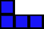

# Pixel Tetris :snake:

## Introduction :star:

***Pixel Tetris*** is a interpretation of the classic game Tetris, developed using the versatile `pygame` library.
This game offers an engaging gaming experience with upgraded graphics and enhanced gameplay mechanics, making it a testament to the possibilities that Python and its rich ecosystem of libraries provide to aspiring programmers.
Python **Pixel Tetris** not only serves as an enjoyable gaming experience but also as a valuable educational tool, as a part of the **Python101 Hackademy** project.

<div align="center">
  
</div>

## 🎥 Linux Version

[▶ Watch Linux Version](Videos/Linux.gif)

## 🎥 Windows Version

[▶ Watch Windows Version](Videos/Windows.gif)

## Tetrominoes :building_construction:

Tetrominoes are the fundamental building blocks in Tetris. They are made up of **4 Blocks** and come in various shapes. There are different types of tetrominoes, including free tetrominoes, one-sided tetrominoes, and fixed tetrominoes. Let's explore them:

<div align="center">
  
  
  
  
  
  
  
</div>

### Free Tetrominoes :repeat:

**Free tetrominoes** are tetrominoes considered up to congruence. That means two free tetrominoes are the same if there is a combination of translations, rotations, and reflections that turns one into the other. There are five free tetrominoes, each with different symmetries:

1. **Straight Tetromino (I):** Vertical andtal reflection symmetry, and two-fold rotational symmetry.
2. **Square Tetromino (O):** Vertical andtal reflection symmetry, and four-fold rotational symmetry.
3. **T-Tetromino (T):** Vertical reflection symmetry only.
4. **L-Tetromino (L):** No symmetry.
5. **S-Tetromino (S):** Two-fold rotational symmetry only.
6. **J-Tetromino (J):** No symmetry.
7. **Z-Tetromino (Z):** No symmetry.

### One-Sided Tetrominoes :arrows_counterclockwise:

**One-sided tetrominoes** are tetrominoes that may be translated and rotated but not reflected. There are seven distinct one-sided tetrominoes. The "`I`", "`O`", and "`T`" tetrominoes have reflectional symmetry, so it does not matter whether they are considered as free tetrominoes or one-sided tetrominoes. The remaining four tetrominoes, "`J`", "`L`", "`S`", and "`Z`," exhibit chirality, meaning `J` and `L` are reflections of each other, and `S` and `Z` are reflections of each other.

As free tetrominoes, `J` is equivalent to `L`, and `S` is equivalent to `Z`. But in two dimensions and without reflections, it is not possible to transform `J` into `L` or `S` into `Z`.

## Fixed Tetrominoes :repeat_one:

**Fixed tetrominoes** are restricted to only translation movements, without any allowance for rotation or reflection. This limitation creates a unique set of tetromino shapes. There are a total of 19 distinct fixed tetrominoes:

- **I-Tetromino**: 2 distinct forms.
- **J-Tetromino**: 4 distinct forms.
- **L-Tetromino**: 4 distinct forms.
- **O-Tetromino**: 1 distinct form.
- **S-Tetromino**: 2 distinct forms.
- **T-Tetromino**: 4 distinct forms.
- **Z-Tetromino**: 2 distinct forms.

## Background Music and Sound Effects :musical_note:

`Background Music` :speaker:: classical music tracks that play in the background during gameplay ***the songs are randomly used in the game***:

**Allegro.ogg**: gameplay with lively, upbeat rhythm.
**Lacrimosa.ogg**: drama and depth to game ambiance.
**Rondo Alla Turka.ogg**: fun and liveliness into gameplay.

`Sound Effects` :sound:: provide immediate ***feedback to player actions and game events***.

**Amadeus-Laughing.ogg**: skillful moves or when achieving a high score.
**Block-Rotate.ogg**: triggered every time a player rotates a Tetromino.
**Force-Hit-Line.ogg**: forcefully placed down quickly.
**Remove-Line.ogg**: player successfully completes and removes a line.
**Slow-Hit-Line.ogg**: Tetromino is placed down slowly and carefully.

## Requirements :clipboard:

- **Python Version:** `Python 3.12`
- **Dependencies:** `Pygame`, and potentially other libraries.
- To install required packages, use the `Terminal.py` utility script.

## Installation :wrench:

You can install all necessary dependencies by running the following command:

```bash
python3 Terminal.py
```

## Module Descriptions :books:

`Terminal.py`
**Purpose**: This module manages the installation of Python packages.
**Key Functions**:

- `install(package)`: Installs a specified Python package using pip.
- `install_dependencies()`: Installs all required dependencies.

`Tetris.py`
**Overview**: This module implements the main game logic and user interface for Pixel Tetris.
**Key Components**:

- `Grid, Wall, Floor`: Manage the Tetris play area.
- `Shape`: Handles the different Tetris pieces.
- `GameState`: Manages the game states (start, in-progress, end).
- `IntroScreen, OutroScreen`: Manage the intro and outro screens of the game.

You can start the game by running the following command:

```bash
python Tetris.py
```

## License :scroll:

- Python Pixel Tetris, is open-source and available under the [MIT License](LICENSE).
- You are free to use, modify, and distribute this project for personal and educational purposes.
- Please review the full license for more details on how you can use this software.
